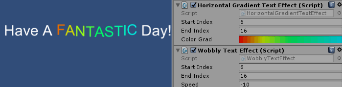
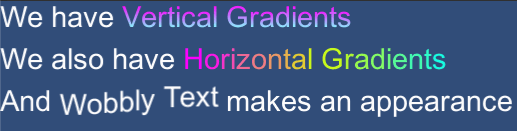

# Text Mesh Effects

Text Mesh Effects are simply Mesh effects intended for use with meshes created by Unity's Text component.  Unity provides an interface to manipulate the vertex stream of any UI component - this is the same interface used by the built in MeshEffects like Outline and Shadow.  Of course, we often want to style text on a per-character basis, which is the root of this set of helpers.

## Included Effects

## Usage & Creation of TextMeshEffects

### BaseTextMeshEffect.cs

This script teakes in the vertex stream and simply handles it 6 vertices at a time, building a new Vertex stream as it goes.  It calls ProcessCharacter() with each set of six.  Components would derive from BaseTextMeshEffect and override the ProcessCharacter function to perform actions on the verts of each character.

### Updating

Some text effects beg to be updated every frame.  You should set up a public function you can manually pump, unless you know the text effect will always be updating.  I don't think it is wise to call SetVerticesDirty() every frame all the time on everything - but for a lot of games text treatment is important.  Take a look at WobblyTextEffect.cs to see how I've chosen to deal with this.

### Using Indices

Sometimes you want to know how a single character compares to the entire set of affected characters.  You can simply override ModifyMesh in the TextMeshEffect and do your processing before calling the base method.  Ensure you call the base function, because BaseTextMeshEffect relies on that call.  Take a look at HorizontalGradientTextEffect.cs to see how I handle that.
